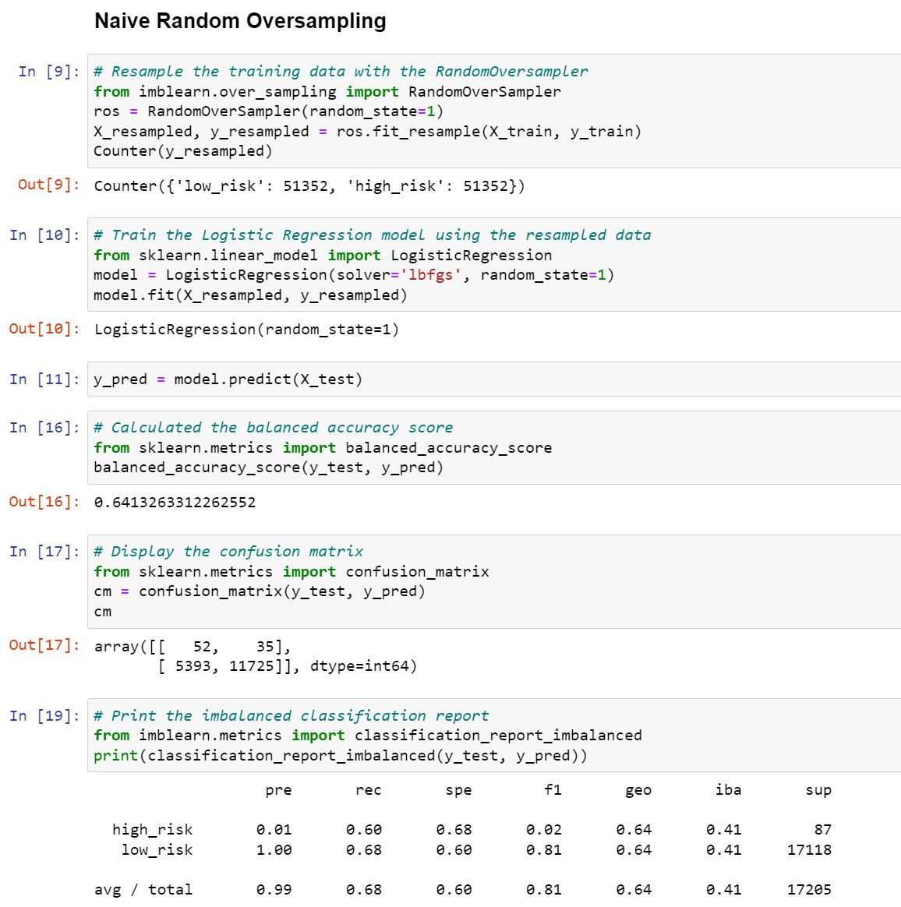
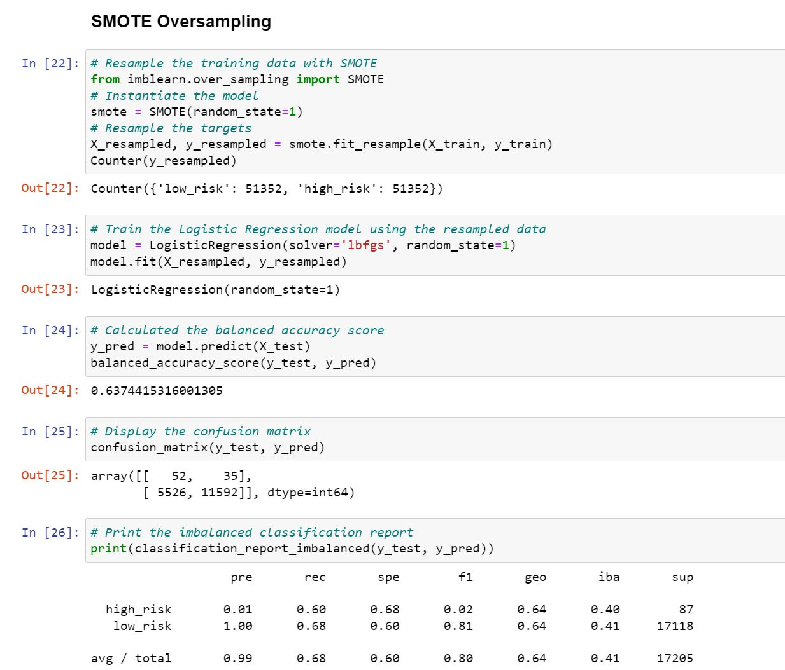
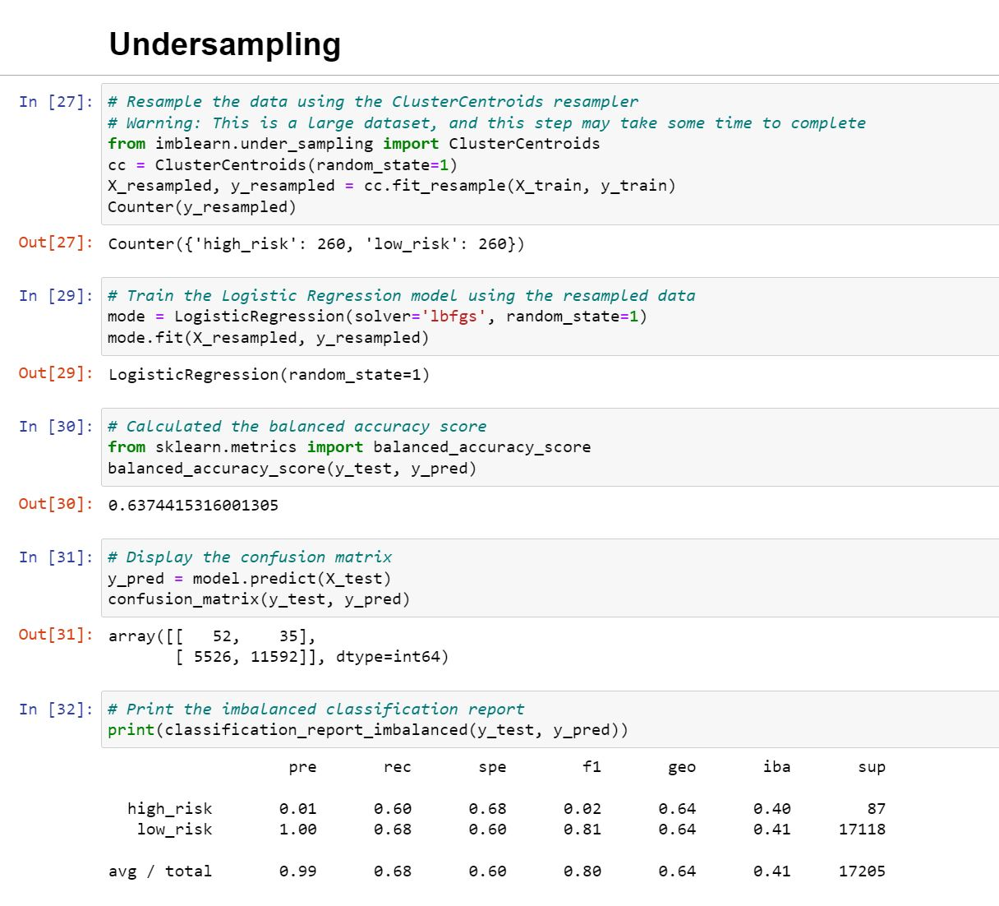
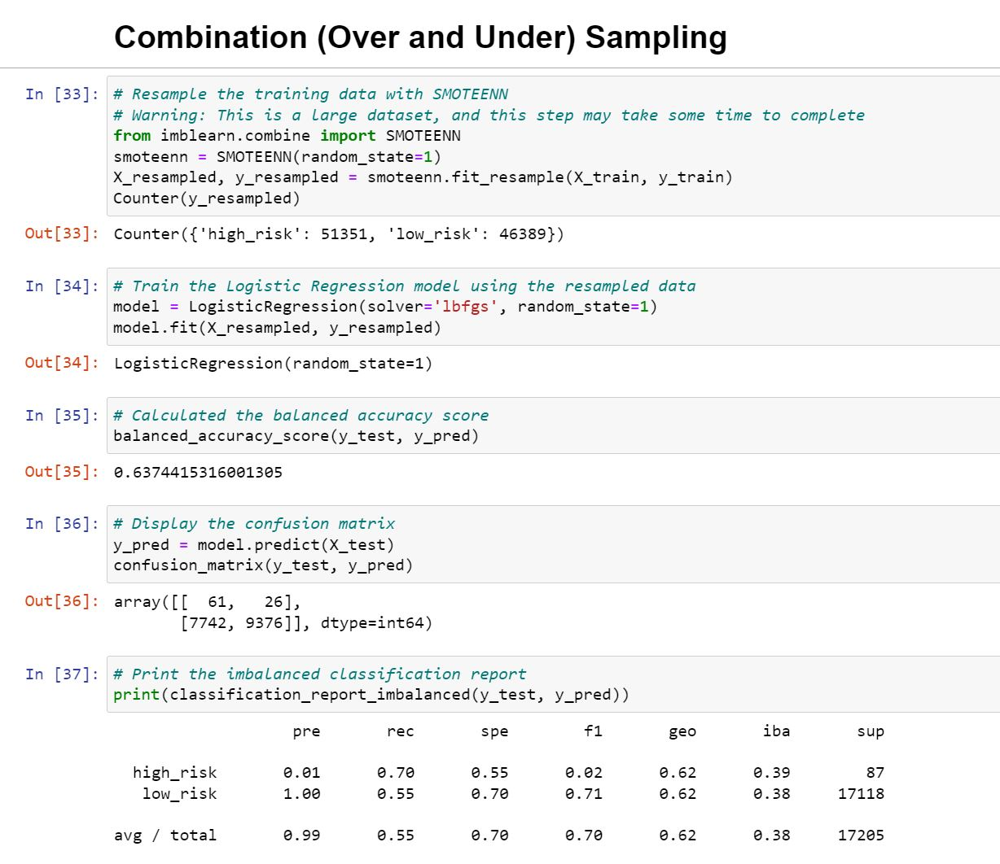
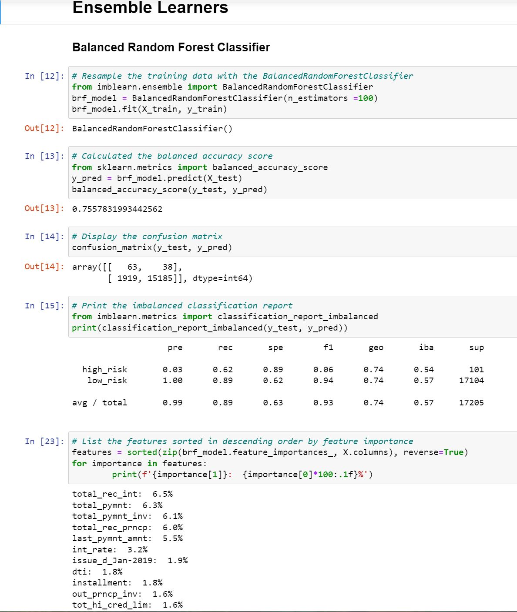
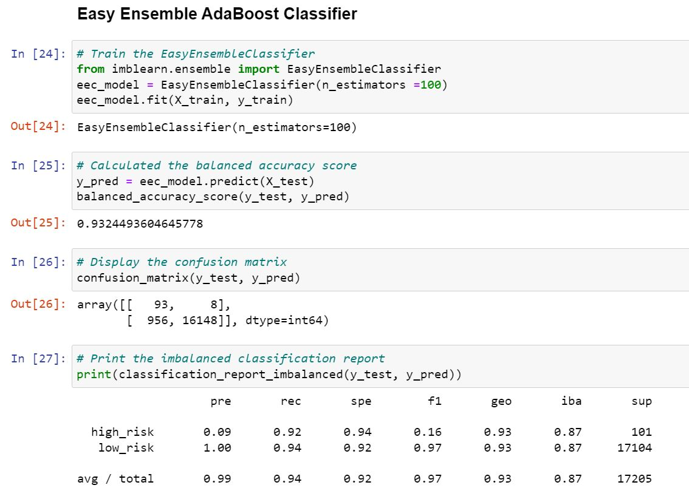

# Credit_Risk_Analysis

## Overview 
The purpose of this analysis was to use various libraries and algorithims to build 
and evaluate machine learning models to predict credit risks. Algorithims included:
* RandomOverSampler
* SMOTE
* ClusterCentroids
* SMOTEEN
* BalancedRandomForestClassifier
* EasyEnsembleClassifier

## Results

* Native Random Over Sampling results: 
	- Accuracy score: 64%
	- Precision score: 1%
	- Recall sore: 60%

* SMOTE
	- Accuracy score: 64%
	- Precision score: 1%
	- Recall sore: 60%

* ClusterCentroids
	- Accuracy score: 64%
	- Precision score: 1%
	- Recall sore: 60%

* SMOTEEN
	- Accuracy score: 64%
	- Precision score: 1%
	- Recall sore: 70%

* BalancedRandomForestClassifier
	- Accuracy score: 76%
	- Precision score: 3%
	- Recall sore: 62%

* EasyEnsembleClassifier
	- Accuracy score: 93%
	- Precision score: 9%
	- Recall sore: 92%

## Summary